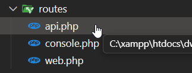
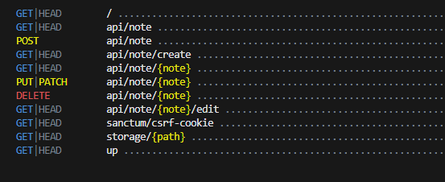
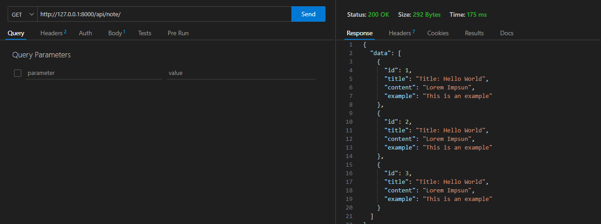
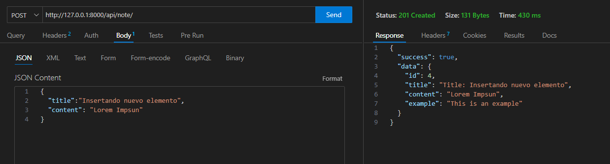

# API de Notas en Laravel

Psos para **clonar** y **probar un proyecto API de Laravel** desde GitHub:

---

### **1. Requisitos previos instalados**

Asegúrate de tener instalados:

* PHP (>= 8.1 recomendado)
* Composer
* Git
* Laravel (opcional, pero útil)
* MySQL o SQLite (según use el proyecto)

---

### **2. Clona el repositorio**

Abre una terminal y ejecuta:

```bash
git clone https://github.com/pamariniesfranciscodelosrios/apinote.git
cd apinote
```

---

### **3. Instala dependencias**

Instala las dependencias PHP con Composer:

```bash
composer install
```

---

### **4. Crea el archivo de entorno**

Copia el archivo `.env.example` como `.env`:

```bash
cp .env.example .env
```

### **5. Genera la clave de la app**

```bash
php artisan key:generate
```

### **6. Ejecuta las migraciones**

```bash
php artisan migrate
```

Te pedirá que se cree la base de datos sqslite, confirma con YES


#### Fíjate que ahora aparece el enrutador api.php 

Será el encargado de gestionar las peticiones HTTP

- Por defecto no viene preconfigurado, hay que instalarlo mediante comando en el caso de crear un nuevo proyecto api
- EL comando para ello será (ahora no es necesario)
  ```
  php artisan install:api
  ```




### **7. Ejecuta el servidor**

```bash
php artisan serve
```

Esto levantará el API en `http://127.0.0.1:8000`.

---

### ✅ **9. (Opcional) Prueba con Postman o ThunderClient (extensión VSC)**

Puedes hacer peticiones `GET`, `POST`, `PUT`, `DELETE` según los endpoints que tenga definida la API (normalmente en `routes/api.php`).

---

Endpoints

### 1. Obtener todas las notas

- **Método:** GET
- **Ruta:** `/api/note`
- **Respuesta:**

```json
{
  "data": [
    {"id": 1, "title": "Nota 1", "content": "Contenido de la nota 1"},
    {"id": 2, "title": "Nota 2", "content": "Contenido de la nota 2"}
  ]
}
```

### 2. Crear una nueva nota

- **Método:** POST
- **Ruta:** `/api/note`
- **Parámetros:**

```json
{
  "title": "Nueva Nota",
  "content": "Contenido de la nota"
}
```

- **Respuesta:**

```json
{
  "success": true,
  "data": {"id": 3, "title": "Nueva Nota", "content": "Contenido de la nota"}
}
```

### 3. Obtener una nota por ID

- **Método:** GET
- **Ruta:** `/api/note/{id}`
- **Respuesta:**

```json
{
  "data": {"id": 1, "title": "Nota 1", "content": "Contenido de la nota 1"}
}
```

### 4. Actualizar una nota

- **Método:** PUT/PATCH
- **Ruta:** `/api/note/{id}`
- **Parámetros:**

```json
{
  "title": "Nota actualizada",
  "content": "Nuevo contenido de la nota"
}
```

- **Respuesta:**

```json
{
  "data": {"id": 1, "title": "Nota actualizada", "content": "Nuevo contenido de la nota"}
}
```

### 5. Eliminar una nota

- **Método:** DELETE
- **Ruta:** `/api/note/{id}`
- **Respuesta:**

```json
{
  "success": true,
  "data": {"id": 1, "title": "Nota eliminada", "content": "Contenido eliminado"}
}
```

## Modelo

La API utiliza el modelo `Note.php`:

```php
class Note extends Model {
    use HasFactory;
    protected $guarded = [];
    protected $hidden = ['created_at', 'updated_at'];
}
```

## Rutas

Las rutas están definidas en `routes/api.php`

También puedes obternerlas con php artisan route:list

```php
Route::resource('/note', 'App\Http\Controllers\NoteController');
```



# Capturas (Thunder Client)

## GET



## POST


